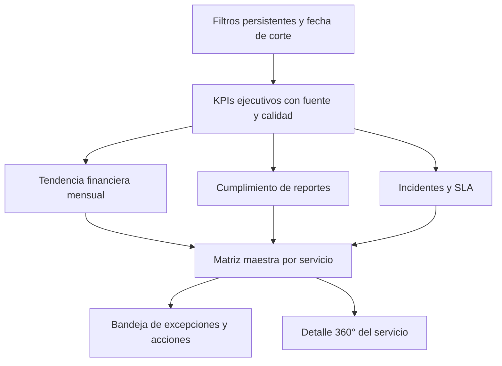

# Plan maestro — Dashboard de Servicios Recurrentes V2

**Autor:** Manus AI  
**Fecha:** 16 de septiembre de 2026  
**Estado:** Propuesta para aprobación; sin cambios funcionales  
**Ámbito:** Portafolio y detalle de servicios recurrentes de Prodigio PMO

## 1. Conclusión ejecutiva

El dashboard actual necesita una reformulación de **datos, reglas y experiencia**, no solo un rediseño visual. Hoy permite contar servicios y ver montos generales, pero no entrega una lectura confiable de compromiso financiero, facturación real, cumplimiento mensual, formalidad contractual, incidentes o cumplimiento efectivo de SLA.

El problema más importante es semántico. La tarjeta actual denominada **“Cumplimiento SLA”** representa la proporción de servicios activos que tienen una configuración SLA, no el porcentaje real de tickets atendidos dentro de los tiempos comprometidos. Del mismo modo, la columna **“Facturado”** por servicio suma el calendario completo de facturación, aunque las mensualidades estén pendientes. Estas etiquetas pueden inducir una conclusión ejecutiva incorrecta.[1] [2]

> **Recomendación central:** construir una “Torre de Control de Servicios Recurrentes” con dos niveles: una vista de portafolio orientada a excepciones y una ficha operativa por servicio. Cada indicador debe mostrar definición, fuente, fecha de corte y estado de calidad. Cuando falte evidencia, debe decir **N/D** o **Por confirmar**, nunca asumir cumplimiento.

## 2. Diagnóstico honesto del dashboard actual

La pantalla actual se compone de cinco tarjetas, tres gráficos y una tabla resumida. La arquitectura visual es limpia, pero la información queda en un nivel descriptivo y no permite priorizar decisiones.[1]

| Pregunta ejecutiva | Respuesta actual | Diagnóstico |
|---|---|---|
| ¿Cuántos servicios gestionamos? | Parcial | Existe el total y el conteo de activos, pero falta distinguir vigentes, por iniciar, próximos a vencer, pausados y cerrados. |
| ¿Cuánto está comprometido por servicio? | Parcial | Existe `totalContractAmount`, pero el total se presenta con una sola moneda y sin reconciliación con contrato corporativo. |
| ¿Cuánto se ha facturado realmente? | Incorrecta | La tabla suma todas las cuotas programadas y las presenta como “Facturado”. |
| ¿Cuánto se ha cobrado? | Parcial | Existe estado `pagado`, pero falta trazabilidad de fecha, evidencia y reconciliación financiera. |
| ¿Se entregaron los reportes mensuales? | No | Los reportes existen como ítems del plan, pero no se consolidan en la vista portafolio. |
| ¿Se entregaron a tiempo y fueron aceptados? | No | No existen fecha real de entrega, aceptación ni evidencia asociada al reporte. |
| ¿El servicio está formalizado? | Parcial | Se puede comprobar presencia de contrato, SoW, propuesta y P&L, pero no vigencia, firma, aprobación ni versión. |
| ¿Cuántos incidentes tiene y cuál es su severidad? | No | La vista de portafolio no consulta ni persiste incidentes JSM. |
| ¿Cumple los SLA? | Incorrecta | Se muestra configuración SLA como si fuera cumplimiento real. |
| ¿Qué servicio requiere atención hoy? | No | No existe una matriz de salud multidimensional ni una bandeja priorizada de excepciones. |
| ¿Qué tipo de servicio es? | Parcial | Existe catálogo canónico, pero no se utiliza como dimensión ejecutiva ni se valida su consistencia con el servicio registrado.[3] |

## 3. Línea base de datos disponible

La revisión de solo lectura encontró **tres servicios activos**. Los tres tienen monto, fechas, cuatro documentos básicos, mensualidades programadas, reportes mensuales planificados y cuatro reglas SLA configuradas. Ninguno está vinculado actualmente a un Service Desk JSM y ninguno tiene análisis de salud vigente. Por tanto, hoy no es posible calcular incidentes reales ni cumplimiento real de SLA.[6]

| Dimensión | Situación observada | Consecuencia para V2 |
|---|---|---|
| Cartera | 3 servicios, todos activos | El KPI de volumen es implementable inmediatamente. |
| Compromiso local | 2.214 registrados localmente como USD | Debe separarse por moneda y validarse contra la fuente contractual. |
| Calendario de facturación | 15 mensualidades por 2.214; todas pendientes | Puede mostrarse lo programado, pero no presentarlo como facturado. |
| Facturado/cobrado | 0 facturado y 0 pagado en el módulo recurrente | El dashboard debe mostrar el cero con su fuente y fecha de actualización. |
| Vencimientos de cobro | 8 mensualidades pendientes con fecha vencida | Debe existir una alerta financiera visible y accionable. |
| Reportes mensuales | 15 planificados; 0 completados; 0 vencidos a la fecha de corte | Puede medirse cumplimiento básico por estado y fecha programada. |
| Evidencia de reportes | Sin archivo, entrega real ni aceptación | Requiere extensión del modelo antes de medir formalidad de entrega. |
| Formalidad documental | Contrato, SoW, propuesta técnica y P&L presentes en los 3 servicios | Puede medirse completitud; no puede inferirse firma o vigencia. |
| SLA | 4 reglas configuradas por servicio | Es configuración, no evidencia de cumplimiento. |
| Incidentes | Sin Service Desk JSM vinculado | Debe mostrarse “Sin integración”, no “100%”. |
| Salud IA | Sin análisis vigente | La salud debe ser determinista; la IA será explicación, no fuente primaria. |

La reconciliación por Deal también muestra una brecha. Solo uno de los tres servicios encuentra datos financieros y contrato corporativo. En ese caso, el contrato está expresado en **UF**, mientras el servicio local está marcado como **USD**. Los otros dos no tienen coincidencia en las fuentes corporativas actuales. Además, dos servicios cuyo nombre contiene “Staffing” están clasificados con otros tipos. Estas inconsistencias deben resolverse antes de considerar confiables los agregados por moneda o tipología.[3] [4] [5] [6]

## 4. Preguntas que deberá responder V2

El nuevo dashboard debe responder en menos de treinta segundos las siguientes preguntas:

| Perspectiva | Preguntas obligatorias |
|---|---|
| Portafolio | ¿Cuántos servicios están activos, próximos a iniciar, próximos a vencer, pausados o cerrados? |
| Finanzas | ¿Cuánto está contratado, programado, facturado, cobrado y vencido, por servicio y por moneda? |
| Entrega | ¿Qué reportes mensuales debían entregarse, cuáles se entregaron a tiempo, tarde o siguen pendientes? |
| Formalidad | ¿Qué servicios tienen contrato, SoW, P&L, SLA y plan formalmente vigentes y aprobados? |
| Operación | ¿Cuántos tickets e incidentes están abiertos, por prioridad, antigüedad y tipo? |
| SLA | ¿Qué porcentaje cumplió primera respuesta y resolución? ¿Cuántos tickets están incumplidos o en riesgo? |
| Riesgo | ¿Qué servicios están rojos y por qué? ¿Qué acción, responsable y fecha compromiso existe? |
| Segmentación | ¿Cómo se distribuye la cartera entre soporte, staffing, requerimientos, evolutivos y mixtos? |
| Trazabilidad | ¿De qué sistema proviene cada métrica y cuándo fue actualizada por última vez? |

## 5. Arquitectura de información propuesta

La propuesta reemplaza la galería de tarjetas por una vista ejecutiva de excepción, manteniendo acceso directo a cada servicio.

### 5.1 Franja de control

La cabecera incluirá **fecha de corte**, última actualización financiera, última actualización JSM y filtros en cascada por estado, cliente, PM, tipo de servicio, salud, formalidad, vínculo JSM y moneda. Los filtros afectarán simultáneamente KPIs, gráficos y matriz, y se podrán restablecer con una sola acción.[7]

### 5.2 KPIs ejecutivos

| KPI | Definición recomendada | Regla de presentación |
|---|---|---|
| Servicios gestionados | Conteo de servicios del filtro actual | Desglose activo, por iniciar, próximo a vencer, pausado y cerrado. |
| Valor comprometido | Monto contractual vigente | Una tarjeta por moneda; nunca sumar UF, USD y CLP. |
| Facturado a la fecha | Facturas emitidas/aceptadas, o cuotas con estado verificable `facturado`/`pagado` | Mostrar monto, porcentaje del contrato, fuente y fecha. |
| Cobrado a la fecha | Pagos recibidos o cuotas verificadas como `pagado` | Separar facturación de cobranza. |
| Cartera vencida | Cuotas pendientes cuya fecha ya pasó | Monto, cantidad y antigüedad. |
| Reportes a tiempo | Reportes entregados hasta su fecha límite / reportes exigibles | Mostrar numerador, denominador y N/D si falta fecha real. |
| Cumplimiento SLA | Tickets cerrados dentro del objetivo / tickets SLA medibles | Separar primera respuesta y resolución. |
| Incidentes abiertos | Tickets de tipo incidente no cerrados | Desglose crítico, alto, medio y bajo. |
| Servicios en atención | Servicios con al menos una excepción crítica | Click abre la bandeja priorizada. |

### 5.3 Zona analítica

La zona central contendrá una tendencia mensual **programado vs. facturado vs. cobrado**, un mapa de cumplimiento de reportes por servicio y mes, una distribución por tipo de servicio y una vista de incidentes por prioridad y antigüedad. Cada gráfico deberá permitir llegar al conjunto de servicios que explica el valor seleccionado.

### 5.4 Matriz maestra por servicio

La matriz será el núcleo operativo. Sus columnas recomendadas son: cliente, servicio, tipo, PM, vigencia, salud, comprometido, facturado, cobrado, vencido, reportes a tiempo, SLA de respuesta, SLA de resolución, incidentes abiertos/críticos, formalidad, vínculo JSM y última sincronización. Las columnas podrán ordenarse y la primera permanecerá fija.

La vista no dependerá exclusivamente del color. Cada semáforo mostrará estado, valor y razón. Un servicio sin JSM deberá decir **“Sin integración JSM”**; uno sin evidencia de entrega deberá decir **“Sin evidencia”**; ninguno aparecerá verde por ausencia de datos.

### 5.5 Detalle 360°

Al seleccionar un servicio se abrirá una ficha o ruta dedicada con cinco pestañas: **Resumen**, **Finanzas**, **Entregables**, **Incidentes y SLA**, y **Documentación**. Esta ficha reutilizará el dashboard de ejecución actual, pero reemplazará los cálculos ambiguos por los contratos de métricas definidos en V2.[2]

## 6. Contrato de métricas y semáforo

El semáforo debe ser determinista y explicable. La IA puede redactar el resumen, pero no inventar ni reemplazar los cálculos.

| Dimensión | Verde | Amarillo | Rojo | N/D |
|---|---|---|---|---|
| Financiera | Sin monto vencido y facturación alineada | Vencido hasta 15 días o desviación menor | Vencido superior a 15/30 días o desviación material | Fuente financiera no conciliada |
| Reportes | ≥95% a tiempo | 80–94% a tiempo | <80% o reporte vencido sin entrega | No existe fecha real/evidencia |
| SLA | ≥95% dentro de objetivo | 90–94% | <90% o incidente crítico incumplido | JSM no vinculado o SLA no medible |
| Incidentes | Sin críticos y antigüedad controlada | Altos o tendencia creciente | Crítico abierto o backlog envejecido | JSM no vinculado |
| Formalidad | Documentos obligatorios vigentes y aprobados | Documento próximo a vencer o pendiente menor | Contrato/SLA obligatorio ausente o vencido | Solo existe archivo sin metadatos de aprobación |

Los umbrales anteriores son una base recomendada y deben aprobarse en la fase de contrato de métricas. La salud global seguirá una regla de **peor dimensión crítica**, acompañada de un puntaje secundario de 0 a 100. Si una dimensión obligatoria está N/D, la salud global quedará **Por confirmar**, no verde.

## 7. Modelo de datos y fuentes de verdad

### 7.1 Finanzas

El calendario local `recurring_service_billing_months` seguirá siendo la fuente del **compromiso mensual programado**. Las tablas corporativas `contract`, `invoice` y `payment` serán la fuente preferida de contrato, factura y cobro cuando exista una reconciliación aprobada por Deal.[4] [5]

Se debe crear una regla explícita de procedencia: `corporativo`, `pmo_manual` o `por_confirmar`. No se deben mezclar montos de diferentes monedas. La conversión a UF o CLP, si se requiere, tendrá fecha y fuente visibles.

### 7.2 Reportes mensuales

Los ítems `informe_mensual` permiten conocer planificación y estado, pero no acreditan entrega o aceptación.[4] Se propone extenderlos, o crear una entidad de evidencias, con periodo, fecha límite, fecha real de entrega, fecha de aceptación, archivo S3, responsable, observación y estado de validación.

### 7.3 Formalidad

Los documentos actuales acreditan presencia de archivo, no vigencia formal.[4] Se requiere estado `borrador/en revisión/aprobado/rechazado/vencido`, versión, fecha de vigencia, fecha de expiración, aprobado por y fecha de aprobación. El dashboard calculará completitud y vigencia por una matriz de documentos obligatorios configurable según tipo de servicio.

### 7.4 Incidentes y SLA

El lector Jira actual puede obtener tipo, prioridad, estado, creación y actualización, pero la vista de ejecución solo consolida cantidad y estado general.[2] [8] V2 deberá obtener resolución y métricas SLA de JSM, normalizarlas y persistir un snapshot agregado por servicio y fecha. Así se podrá mostrar tendencia, antigüedad y cumplimiento sin hacer múltiples llamadas externas durante cada render.

## 8. Alternativas de actualización JSM

| Enfoque | Operación | Ventajas y compromisos | Costo | Complejidad |
|---|---|---|---|---|
| Actualización manual | Botón “Actualizar ahora” por servicio o portafolio; la pantalla muestra el último corte | Implementación más liviana y control total, pero los datos pueden quedar desactualizados si nadie ejecuta la acción | Sin ejecución recurrente | Baja |
| Actualización diaria más botón manual | Un proceso determinista actualiza snapshots en segundo plano y conserva historial; el usuario puede forzar una actualización | Recomendado para gestión ejecutiva; datos comparables y sin depender de una sesión abierta | Sin sesiones de IA por ejecución | Media |

La recomendación funcional es la segunda alternativa, con ejecución idempotente, registro de corridas, reintentos controlados y estado parcial por servicio. La alternativa manual debe mantenerse como contingencia y para validación inicial.

## 9. Backlog de implementación por fases

| Fase | Alcance | Entregables verificables | Dependencias |
|---|---|---|---|
| **R0 — Guardrail y línea base** | Verificar sincronismo, registrar commit base, capturas y contratos actuales | Gate local/remoto, inventario de métricas y fixture sanitizado | Ninguna |
| **D0 — Contrato de métricas** | Aprobar definiciones, fuentes, corte, monedas, umbrales y reglas N/D | Diccionario de métricas versionado y pruebas de fórmulas | Aprobación de negocio |
| **D1 — Calidad y reconciliación** | Corregir tipos, monedas, Deal y fuentes financieras; marcar faltantes | Vista de calidad y estados `conciliado/por confirmar` | D0 |
| **D2 — Modelo de datos** | Incorporar evidencia de reportes, formalidad documental, fechas de facturación/cobro y snapshots JSM | Migración aditiva, índices, auditoría y rollback documentado | D0–D1 |
| **D3 — API consolidada** | Crear endpoint agregado con filtros, fecha de corte, KPIs, series y matriz | Respuesta tipada, paginada, sin N+1 y con pruebas | D2 |
| **D4 — Torre de control** | Implementar filtros, KPIs, matriz maestra y bandeja de excepciones | Portafolio usable en escritorio y tablet | D3 |
| **D5 — Módulo financiero** | Programado, facturado, cobrado, vencido y conciliación por Deal/moneda | Tendencia mensual, waterfall y detalle por cuota | D1–D4 |
| **D6 — Entregables y formalidad** | Reportes mensuales, evidencia, aceptación y documentos obligatorios | Heatmap de cumplimiento y score de formalidad | D2–D4 |
| **D7 — Incidentes y SLA** | Lectura JSM, snapshots, prioridades, antigüedad, respuesta y resolución | KPIs reales, tendencias y lista de incumplimientos | Vínculos JSM y D2–D4 |
| **D8 — Detalle 360°** | Reorganizar dashboard por servicio y navegación desde la matriz | Cinco pestañas con trazabilidad completa | D4–D7 |
| **D9 — Actualización y observabilidad** | Actualización diaria/manual, historial, errores parciales y frescura | Registro de corridas, última actualización y reintentos seguros | D7 |
| **D10 — Certificación y despliegue** | Pruebas de datos, permisos, visuales, rendimiento y regresión | Matriz de aceptación, screenshots y manual operativo | D0–D9 |

## 10. Backlog técnico detallado

### D0. Contrato de métricas

| ID | Trabajo | Criterio de aceptación |
|---|---|---|
| D0.1 | Definir glosario de contratado, programado, devengado, facturado, cobrado y vencido | Ninguna etiqueta comparte significados distintos. |
| D0.2 | Definir fecha de corte y zona horaria | Todas las métricas reproducen el mismo resultado para un corte dado. |
| D0.3 | Definir política multimoneda | No existe suma cruzada; toda conversión muestra tasa, fuente y fecha. |
| D0.4 | Aprobar reglas de salud y N/D | Un dato ausente nunca produce verde ni 100%. |

### D1–D2. Calidad y persistencia

| ID | Trabajo | Criterio de aceptación |
|---|---|---|
| D1.1 | Crear control de coherencia entre nombre y tipo de servicio | Staffing se clasifica explícitamente como `staffing` cuando corresponda. |
| D1.2 | Reconciliar Deal, moneda y contrato | Cada servicio tiene fuente financiera y estado de conciliación. |
| D1.3 | Validar vínculos JSM | Cada servicio muestra `vinculado`, `sin vínculo`, `degradado` o `sin permiso`. |
| D2.1 | Agregar evidencia y aceptación de reportes | El cumplimiento usa fecha real y archivo, no solo estado manual. |
| D2.2 | Agregar metadatos de formalidad documental | Es posible distinguir archivo presente de documento aprobado y vigente. |
| D2.3 | Agregar fechas/evidencia de factura y pago | Facturado y cobrado quedan auditables. |
| D2.4 | Crear snapshots de incidentes/SLA y corridas | Se conserva fecha de corte, fuente, conteos y resultado por servicio. |

### D3–D8. Backend y experiencia

| ID | Trabajo | Criterio de aceptación |
|---|---|---|
| D3.1 | Crear agregador de portafolio en servidor | Filtros y totales se calculan en servidor; no se carga todo al navegador. |
| D3.2 | Separar programado, facturado y pagado | Pruebas cubren los tres estados y mensualidades vencidas. |
| D3.3 | Calcular reportes exigibles y puntualidad | Numerador y denominador son visibles y reproducibles. |
| D3.4 | Calcular SLA real solo con tickets medibles | Sin JSM devuelve N/D con razón. |
| D4.1 | Implementar filtros en cascada y URL compartible | El estado se preserva al navegar y volver. |
| D4.2 | Implementar KPIs con tooltips de fórmula/fuente | Cada KPI explica cálculo, corte y frescura. |
| D4.3 | Implementar matriz maestra y drill-down | Ordenamiento y navegación funcionan con teclado y mouse. |
| D4.4 | Implementar bandeja de excepciones | Cada excepción incluye severidad, razón, responsable y acción. |
| D5.1 | Crear tendencia financiera | Programado, facturado y cobrado nunca se confunden visualmente. |
| D6.1 | Crear heatmap de reportes | Se distinguen a tiempo, tarde, pendiente, no exigible y sin evidencia. |
| D6.2 | Crear panel de formalidad | Se distingue completitud de vigencia/aprobación. |
| D7.1 | Integrar prioridades, estados y antigüedad JSM | Los conteos coinciden con una muestra validada en JSM. |
| D7.2 | Integrar primera respuesta y resolución | El SLA se calcula por ticket y se agrega por servicio/periodo. |
| D8.1 | Reorganizar detalle 360° | El usuario llega desde una excepción al dato y evidencia que la originó. |

### D9–D10. Operación y certificación

| ID | Trabajo | Criterio de aceptación |
|---|---|---|
| D9.1 | Incorporar actualización manual idempotente | Repetir la misma corrida no duplica snapshots ni métricas. |
| D9.2 | Incorporar actualización diaria opcional | La corrida registra inicio, fin, éxito parcial, error y próxima ejecución. |
| D9.3 | Mostrar frescura de datos | Toda zona externa indica última actualización y estado. |
| D10.1 | Pruebas unitarias y persistentes | Fórmulas, filtros, permisos e idempotencia quedan cubiertos. |
| D10.2 | Validación visual responsive | Sin cortes en 1440, 1280, 1024 y móvil de consulta. |
| D10.3 | Prueba de rendimiento | La carga inicial del portafolio evita N+1 y mantiene tiempos acordados. |
| D10.4 | Despliegue gradual | Comparación V1/V2, piloto y rollback sin pérdida de datos. |

## 11. Criterios de aceptación globales

| Categoría | Condición de cierre |
|---|---|
| Exactitud | Totales y porcentajes se reconcilian contra consultas SQL y muestras JSM. |
| Honestidad de datos | Todo faltante se muestra como N/D o Por confirmar con una razón. |
| Finanzas | Comprometido, programado, facturado y cobrado son conceptos separados. |
| Multimoneda | No existe agregado cruzado sin conversión explícita. |
| Reportes | Se puede identificar periodo, vencimiento, entrega, aceptación y evidencia. |
| SLA | Configuración y cumplimiento son indicadores distintos. |
| Incidentes | Se puede filtrar por servicio, prioridad, estado, antigüedad y fecha de corte. |
| Seguridad | Roles actuales se conservan; acciones de actualización o edición respetan permisos. |
| Rendimiento | Agregación de servidor, paginación y snapshots evitan llamadas externas por fila. |
| Trazabilidad | Cada KPI muestra fuente, corte, frescura y vínculo al detalle. |
| Sincronismo | Cada fase inicia con gate de versión, cambios pequeños y checkpoint verificable. |

## 12. Orden recomendado

No recomiendo comenzar por los gráficos. El orden correcto es **D0 → D1 → D3/D4 → D5 → D2/D6 → D7 → D8 → D9/D10**. Esto permite entregar primero una torre de control honesta con los datos existentes, y luego enriquecerla con evidencia de reportes y métricas reales de JSM.

La primera entrega visible debería incluir: KPIs corregidos, multimoneda, filtros, matriz maestra, programado/facturado/cobrado separados, reportes mensuales básicos, formalidad por presencia documental y alertas de calidad. La segunda incorporaría evidencia, aceptación y vigencia. La tercera agregaría incidentes y SLA reales una vez vinculados los Service Desk.

## 13. Decisiones necesarias antes de implementar

| Decisión | Recomendación propuesta |
|---|---|
| Fuente principal de facturación real | Usar `invoice/payment` corporativos cuando estén conciliados; fallback manual claramente identificado. |
| Fecha de corte | Hoy por defecto, con selector histórico. |
| Salud global | Peor dimensión crítica + puntaje secundario; N/D bloquea verde. |
| Actualización JSM | Diaria y manual, con snapshots e historial. |
| Despliegue | V2 en convivencia con V1 durante piloto; reemplazo solo después de certificación. |

## Anexo A — Línea base observada

La línea base proviene de consultas SQL de solo lectura ejecutadas el 16 de septiembre de 2026. No se modificaron datos. Los resultados relevantes fueron: tres servicios activos; compromiso local por 2.214 en moneda marcada USD; quince mensualidades pendientes; cero facturado y cero pagado; ocho mensualidades vencidas; quince reportes mensuales planificados; cero reportes completados; cuatro documentos y cuatro reglas SLA por servicio; cero vínculos JSM y cero análisis de salud vigentes.

## Referencias

[1]: ../client/src/pages/RecurringServicesList.tsx "Dashboard actual de servicios recurrentes"
[2]: ../client/src/pages/recurring/RSExecutionStage.tsx "Dashboard actual de ejecución por servicio"
[3]: ../shared/recurringServiceTypes.ts "Catálogo canónico de tipos de servicio"
[4]: ../drizzle/schema.ts "Modelo de datos de servicios recurrentes"
[5]: ../drizzle/schema.ts "Modelo financiero corporativo y consolidado de facturación"
[6]: #anexo-a--línea-base-observada "Consultas SQL de solo lectura — 16 de septiembre de 2026"
[7]: ../../skills/consolidated-dashboard/SKILL.md "Patrón de dashboard consolidado"
[8]: ../server/jiraClient.ts "Lector Jira/JSM actual"
[9]: ../server/recurringServicesRouter.ts "Agregaciones actuales del módulo recurrente"
